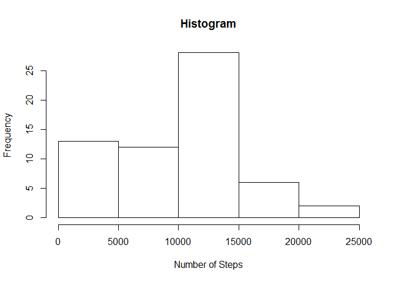
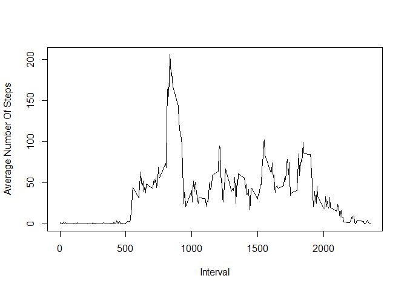
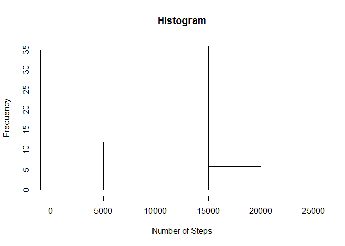
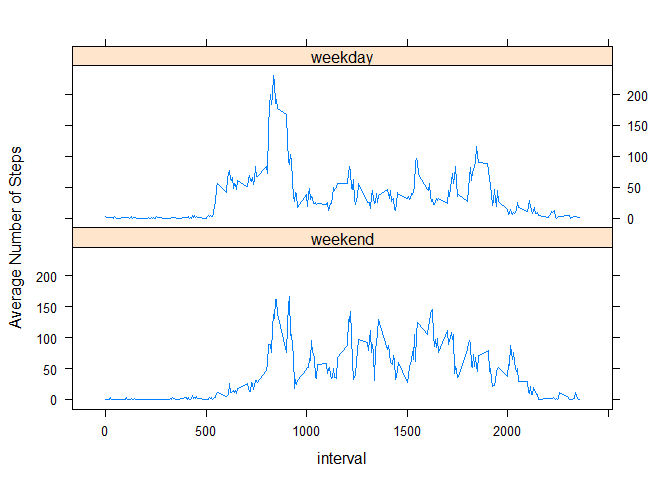

# Reproducible Research: Peer Assessment 1


## Loading and preprocessing the data


```r
library(data.table)
#load the data from the zip file
data <- read.csv(unz("activity.zip", "activity.csv"))
#convert the data.frame to a data.table for easy manipulation
DT <- data.table(data)
```

## What is mean total number of steps taken per day?

1. Calculate the total number of steps taken per day


```r
DT_by_date <- DT[,list(sum_by_date=sum(steps, na.rm=T)),by=date]
```

2. If you do not understand the difference between a histogram and a barplot, research the difference between them. Make a histogram of the total number of steps taken each day


```r
hist(DT_by_date[,sum_by_date],  main = "Histogram", xlab = "Number of Steps")
```

 

3. Calculate and report the mean and median of the total number of steps taken per day


```r
mean(DT_by_date[,sum_by_date])
```

```
## [1] 9354.23
```

```r
median(DT_by_date[,sum_by_date])
```

```
## [1] 10395
```

## What is the average daily activity pattern?

1. Make a time series plot (i.e. type = "l") of the 5-minute interval (x-axis) and the average number of steps taken, averaged across all days (y-axis)


```r
DT_by_interval <- DT[,list(avg_by_interval=mean(steps, na.rm=T)),by=interval]
plot(DT_by_interval,type = "l", xlab="Interval", ylab="Average Number Of Steps")
```

 

2. Which 5-minute interval, on average across all the days in the dataset, contains the maximum number of steps?


```r
DT_by_interval[which.max(DT_by_interval[,avg_by_interval]),interval]
```

```
## [1] 835
```

The 5-minute interval with the highest average across all the days in the dataset is 835.

## Imputing missing values

1. Calculate and report the total number of missing values in the dataset (i.e. the total number of rows with NAs)


```r
sum(!complete.cases(DT)) 
```

```
## [1] 2304
```

2. Devise a strategy for filling in all of the missing values in the dataset. The strategy does not need to be sophisticated. For example, you could use the mean/median for that day, or the mean for that 5-minute interval, etc.

My strategy is to replace the NA values by the mean of the value for that 5 minute interval.

3. Create a new dataset that is equal to the original dataset but with the missing data filled in.


```r
setkey(DT, interval)
setkey(DT_by_interval, interval)
filled_DT<-DT[DT_by_interval,list(date,interval,steps=ifelse(is.na(steps),avg_by_interval,steps))]
```

4. Make a histogram of the total number of steps taken each day and Calculate and report the mean and median total number of steps taken per day. 


```r
DT_by_date <- filled_DT[,list(sum_by_date=sum(steps)),by=date]
hist(DT_by_date[,sum_by_date],  main = "Histogram", xlab = "Number of Steps")
```

 

```r
mean(DT_by_date[,sum_by_date])
```

```
## [1] 10766.19
```

```r
median(DT_by_date[,sum_by_date])
```

```
## [1] 10766.19
```

*Do these values differ from the estimates from the first part of the assignment?* 

Yes both of them differ.

*What is the impact of imputing missing data on the estimates of the total daily number of steps?*

By imputing using the mean value for the interval, the histogram becomes more nicely distributed. It is no longer skewed towards 0.

## Are there differences in activity patterns between weekdays and weekends?

1. Create a new factor variable in the dataset with two levels – “weekday” and “weekend” indicating whether a given date is a weekday or weekend day.


```r
# Needed for the weekday code to work correctly on my Japanese machine
Sys.setlocale("LC_TIME","English")
```

```
## [1] "English_United States.1252"
```

```r
filled_DT$date <- as.Date(filled_DT$date)
weekdays1 <- c('Monday', 'Tuesday', 'Wednesday', 'Thursday', 'Friday')
filled_DT$weekday <-  factor((weekdays(filled_DT$date) %in% weekdays1)+1L,levels=1:2, labels=c('weekend', 'weekday'))
```

2. Make a panel plot containing a time series plot (i.e. type = "l") of the 5-minute interval (x-axis) and the average number of steps taken, averaged across all weekday days or weekend days (y-axis). See the README file in the GitHub repository to see an example of what this plot should look like using simulated data.


```r
DT_by_weekday_by_interval <- filled_DT[,list(avg_by_interval=mean(steps, na.rm=T)),by=list(weekday,interval)]

library(lattice)
xyplot(avg_by_interval~interval | weekday, data=DT_by_weekday_by_interval,layout=c(1,2), type = "l", ylab = "Average Number of Steps")
```

 


